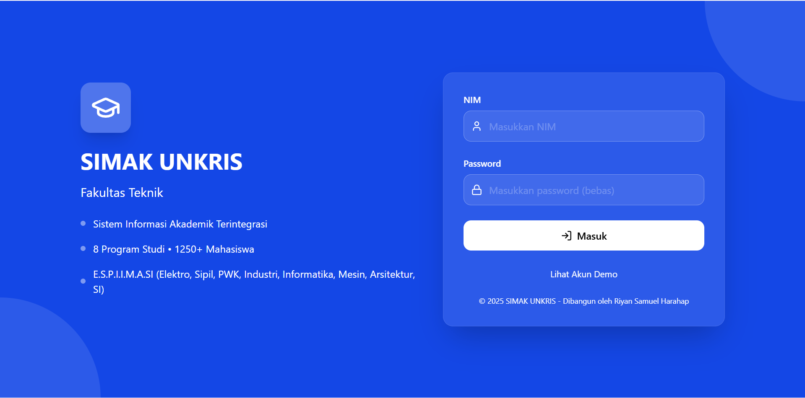
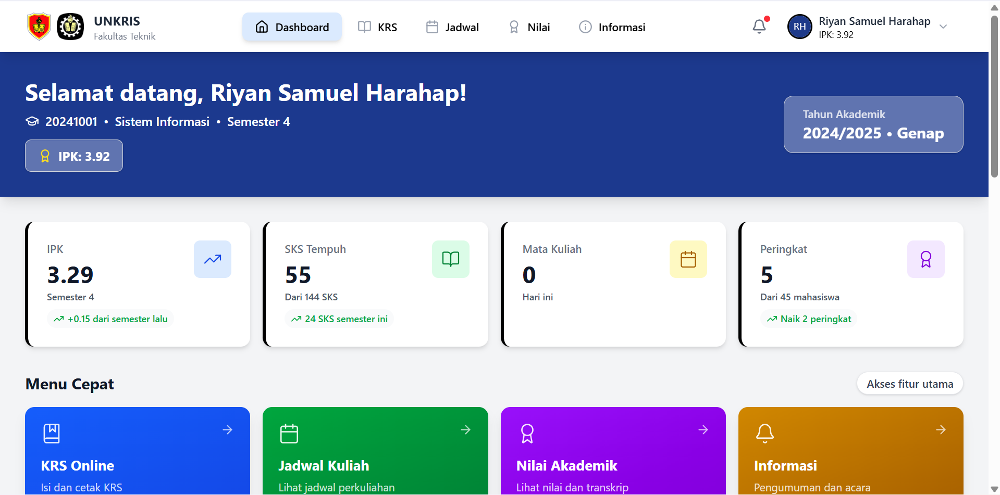
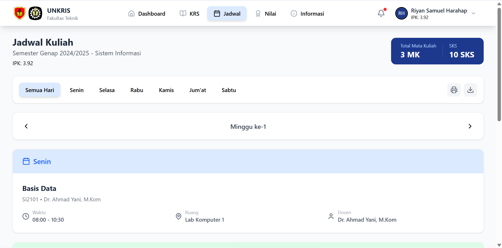
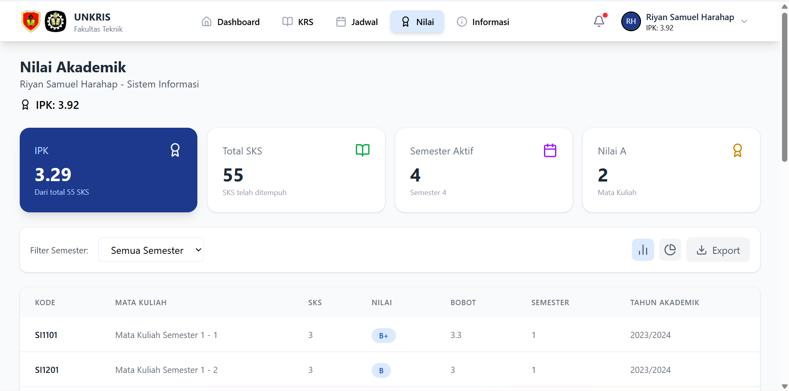
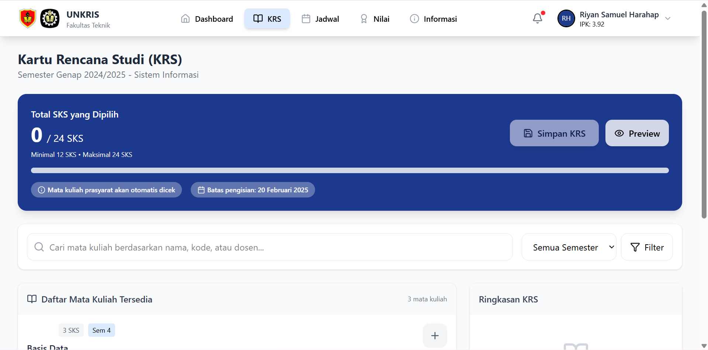

# SISTEM INFORMASI AKADEMIK (SIMAK) UNKRIS


-brightgreen)

  

## 📋 Tentang Proyek

**SIMAK UNKRIS** adalah sistem informasi akademik berbasis web yang dirancang untuk memudahkan pengelolaan data akademik di Universitas Krisnadwipayana (UNKRIS). Proyek ini merupakan **purwarupa frontend** yang dibangun dengan **JavaScript murni (Vanilla JS)** menggunakan Vite sebagai build tool dan Tailwind CSS untuk styling. Seluruh data yang ditampilkan bersumber dari berkas **`dummy.js`**, sehingga tidak memerlukan backend server (seperti PHP/MySQL) atau database riil. Tujuannya adalah untuk memvisualisasikan alur kerja dan antarmuka pengguna sebelum diintegrasikan dengan backend sesungguhnya.

## ✨ Fitur Utama

*   **Manajemen Mahasiswa** : Lihat daftar mahasiswa, detail, dan histori akademik (data dummy).
*   **Manajemen Dosen** : Tampilkan data dosen beserta mata kuliah yang diampu (data dummy).
*   **Manajemen Mata Kuliah** : Telusuri kurikulum, silabus, dan bobot SKS (data dummy).
*   **Penjadwalan Kuliah** : Simulasi jadwal perkuliahan per ruang dan waktu (data dummy).
*   **Input & Pengelolaan Nilai** : Simulasi halaman input nilai oleh dosen dan tampilan nilai bagi mahasiswa.
*   **Autentikasi & Otorisasi** : Simulasi multi-level user (Admin, Dosen, Mahasiswa) berdasarkan state frontend.
*   **Laporan Akademik** : Simulasi tampilan KHS (Kartu Hasil Studi) dan KRS (Kartu Rencana Studi).

## 🛠️ Teknologi yang Digunakan

Proyek ini dibangun dengan teknologi frontend modern:

*   **Frontend**:
    *   **Bahasa**: HTML5, CSS3, **JavaScript (ES6+)**
    *   **Framework CSS**: [Tailwind CSS](https://tailwindcss.com/) untuk styling yang responsif dan cepat.
    *   **Build Tool**: [Vite](https://vitejs.dev/) untuk pengembangan dengan hot-reload dan bundling produksi.
    *   **Linting**: ESLint untuk menjaga konsistensi kode.
*   **Data & State**:
    *   **Data Dummy**: Semua data disimpan dalam berkas **`dummy.js`** (objek JavaScript) untuk mensimulasikan database.
    *   **State Management**: Menggunakan mekanisme state sederhana berbasis JavaScript murni.
*   **Tools**:
    *   **Manajemen Paket**: npm
    *   **Version Control**: Git
    *   **Konfigurasi**: `vite.config.js`, `tailwind.config.js`, `postcss.config.js`, `eslint.config.js`

## 🚀 Cara Menjalankan Proyek (Lokal)

Karena proyek ini hanya frontend, Anda tidak perlu menginstal database atau server backend. Cukuk ikuti langkah berikut:

### Prasyarat
Pastikan Anda telah menginstal:
*   [Git](https://git-scm.com/)
*   [Node.js](https://nodejs.org/) (versi 18 atau lebih baru, termasuk npm)

### Langkah Instalasi

1.  **Clone repositori**
    ```bash
    git clone https://github.com/Okeanos404/simak-unkris.git
    ```

2.  **Masuk ke direktori proyek**
    ```bash
    cd simak-unkris
    ```

3.  **Instal dependensi**
    ```bash
    npm install
    ```

4.  **Jalankan server pengembangan**
    ```bash
    npm run dev
    ```
    Setelah perintah ini, Vite akan menampilkan URL lokal (biasanya `http://localhost:5173`). Buka URL tersebut di browser.

5.  **Login (Simulasi)**
    Gunakan kredensial berikut (atau sesuai yang didefinisikan di `dummy.js`):
    *   **Admin**: `admin` / `admin123`
    *   **Dosen**: `dosen` / `dosen123`
    *   **Mahasiswa**: `mahasiswa` / `mahasiswa123`
    *(Silakan cek berkas `dummy.js` untuk data autentikasi yang sebenarnya)*

## 📸 Tangkapan Layar

Berikut beberapa tampilan dari aplikasi (ganti dengan screenshot asli proyek Anda):

| Dashboard Admin | Halaman Mahasiswa |
| :---: | :---: |
|  |  |

| Input Nilai | Laporan KHS |
| :---: | :---: |
|  |  |

> **Catatan:** Simpan screenshot Anda di folder `src/assets/` (atau buat subfolder `images`) dan sesuaikan path di atas.

## 🧪 Tentang Data Dummy

Semua data yang ditampilkan dalam aplikasi ini berasal dari berkas **`dummy.js`** yang terletak di direktori `src` (atau sesuai struktur proyek). Berkas ini mengekspor objek JavaScript berisi array untuk entitas seperti:
- `mahasiswa`
- `dosen`
- `matakuliah`
- `jadwal`
- `nilai`
- `users` (untuk autentikasi)

Jika ingin menyesuaikan data, cukup edit berkas tersebut. Tidak perlu mengubah database atau konfigurasi lainnya.

## 🤝 Kontribusi

Kontribusi sangat terbuka! Anda dapat membantu mengembangkan proyek ini dengan:
- Menambah halaman/fitur baru.
- Memperbaiki UI/UX.
- Menyempurnakan data dummy.
- Menambahkan animasi atau interaktivitas.

Langkah-langkah:
1. Fork repositori ini
2. Buat branch fitur baru (`git checkout -b fitur/FiturKeren`)
3. Commit perubahan (`git commit -m 'Menambahkan fitur keren'`)
4. Push ke branch (`git push origin fitur/FiturKeren`)
5. Buat Pull Request

## 📄 Lisensi

Proyek ini didistribusikan di bawah lisensi **MIT**. Silakan lihat file `LICENSE` untuk informasi lebih lanjut.

## 📞 Kontak

*   **Pengembang**: Riyan
*   **Email**: riyansmauel6@gmail.com
*   **Link Proyek**: [https://github.com/Okeanos404/simak-unkris](https://github.com/Okeanos404/simak-unkris)

---

**Catatan Penting:** Proyek ini adalah **purwarupa frontend** yang menggunakan data statis. Untuk menjadi aplikasi yang fungsional penuh, perlu diintegrasikan dengan backend API dan database riil.